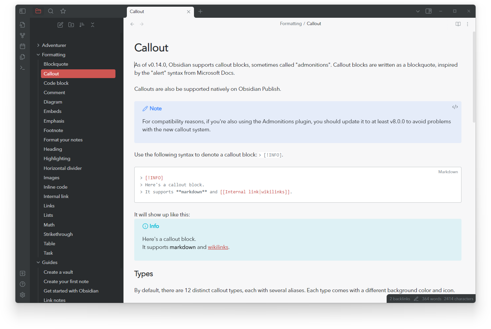
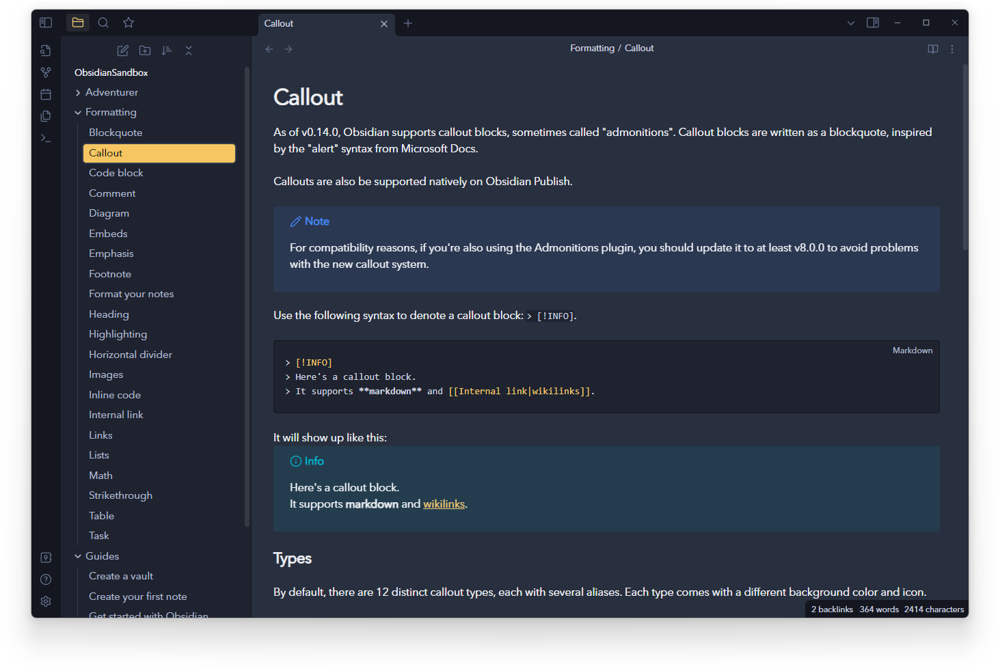
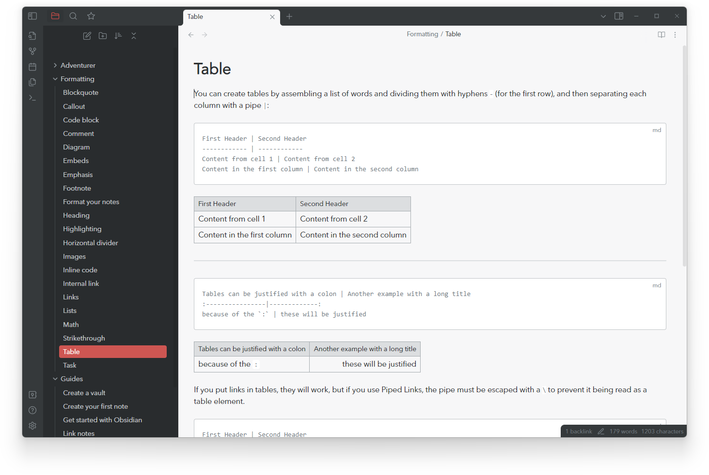
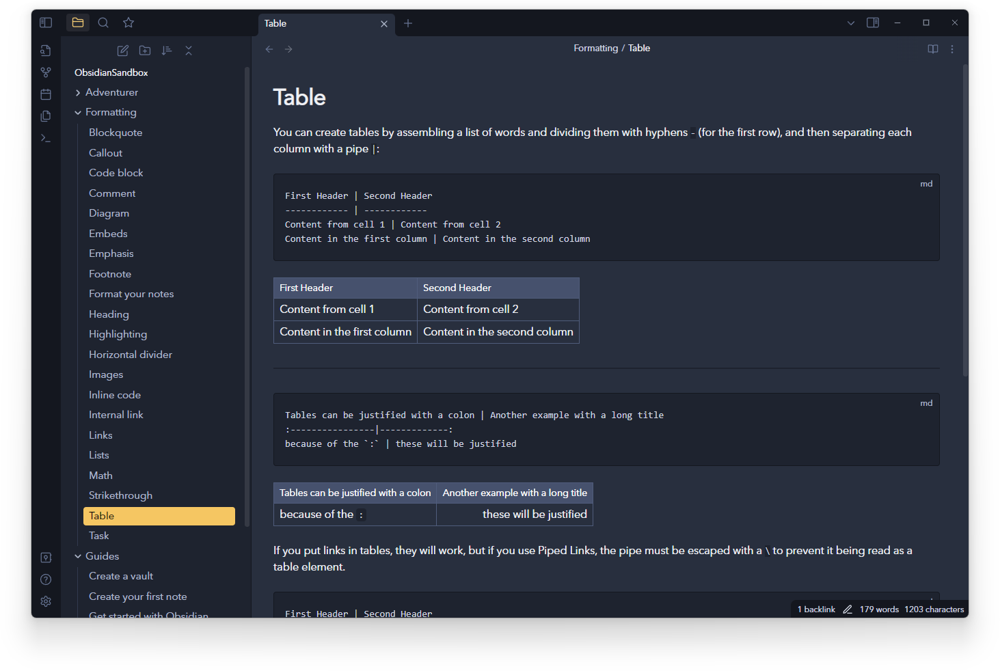
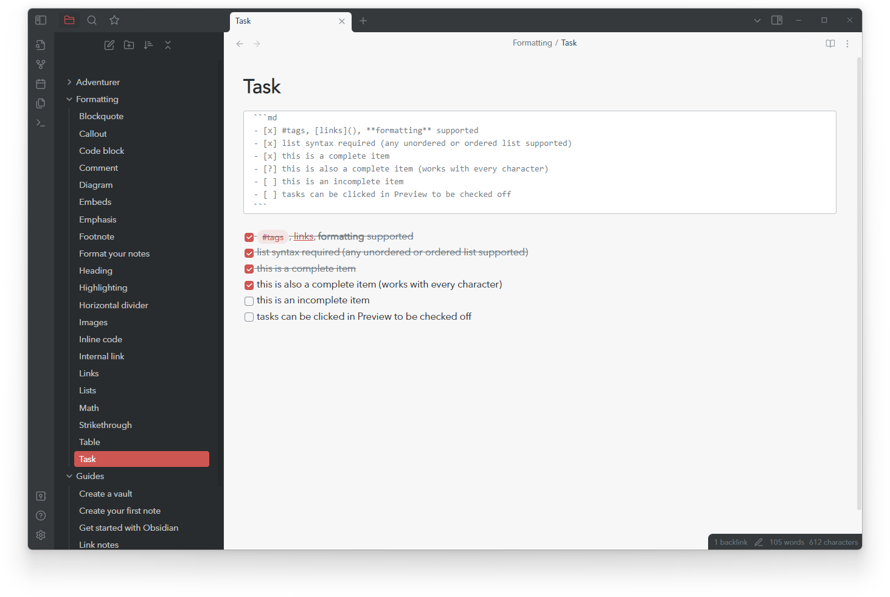
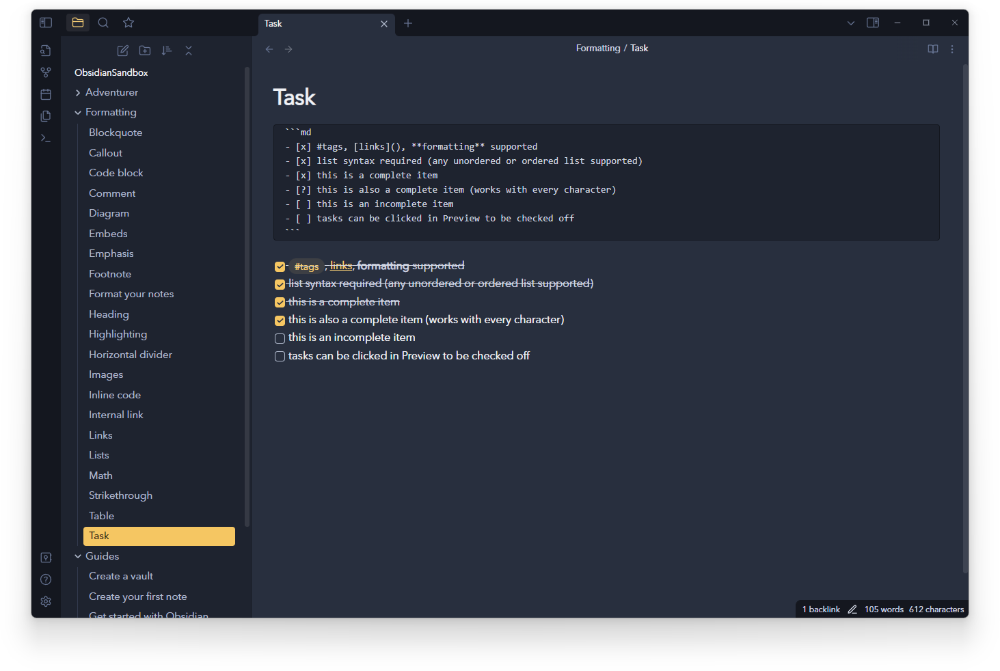
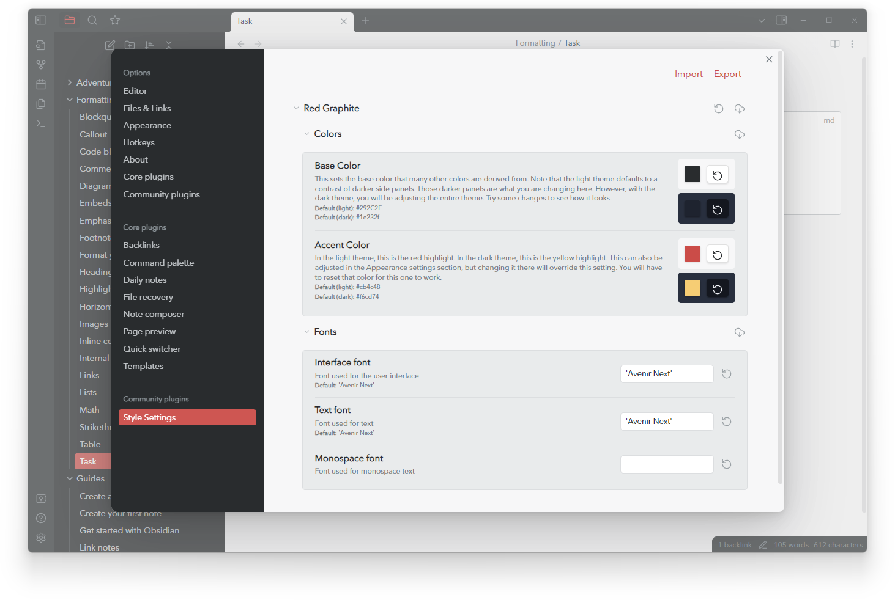
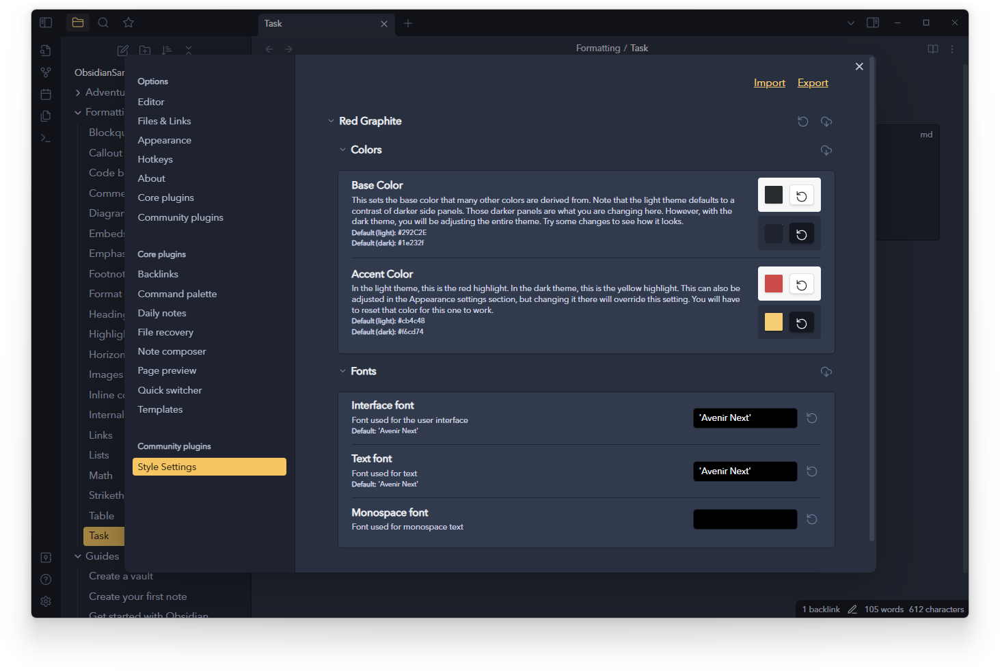

# Red Graphite for Obsidian
A minimal theme for [Obsidian](https://obsidian.md/) with both light and dark variants. This theme is based on Bear.app's Red Graphite theme.

Here are a couple screenshots (with more further down the page):




## Installation
- Open Obsidian settings
- In the `Appearance` section, click the `Manage` button
- Search for "Red Graphite" in the community themes, and select it
- Click the `Use this theme` button

## A note about development and updates

The original Red Graphite theme has been largely untouched for over a year. Between work and family, keeping up with it wasn't a priority. I even personally switched to various other themes (mostly just the amazing [Minimal](https://github.com/kepano/obsidian-minimal) theme). Some of those other theme developers are adding amazing features that I love to use on a daily basis, so Red Graphite fell in priority.

However, with the 1.0 release of Obsidian, I really wanted to release an updated version of the theme for those that prefer its simplicity. I won't be as active as other theme developers, and with that in mind, I've made this version not much more than a color-theme for the default theme. Most of the changes are with the UI and there are not many changes to the actual rendering of your notes.

## More Screenshots

Here's a few more screenshots in addition to those above:






## Style Settings

If you use the Style Settings plugin, you can adjust a few things. Here you can see changing the base and accent colors. Most of the colors in the theme are derived from the base color, so play with it and see if you like a different color. 





## Build

If you want to fork this and make your own version, feel free to. Hopefully you are familiar with build systems like NPM and Grunt, here are just a few notes.

You will need to make a `.env` file (copy/rename the `.env.example` file). This just defines a location for Grunt to copy files to. It should be the location of some vault that you want to test the theme in.

After cloning, install dependencies:

```shell
npm install
```

Run in dev mode (watch):

```shell
npm run dev
```

Build for distribution:

```shell
npm run build
```

## License
This theme is copied from Bear.app's Red Graphite theme, so it would be silly to pretend to have a license. Do as you please, all credit to the Bear designers for putting good colors together.