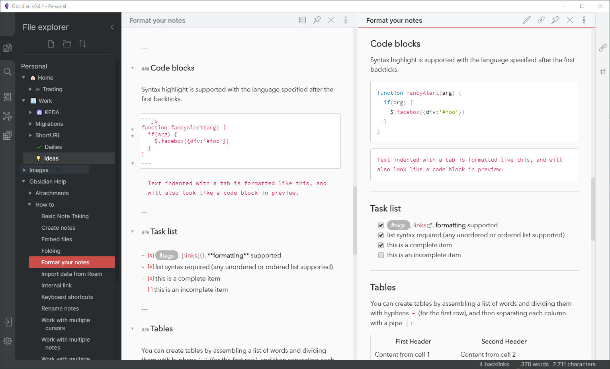
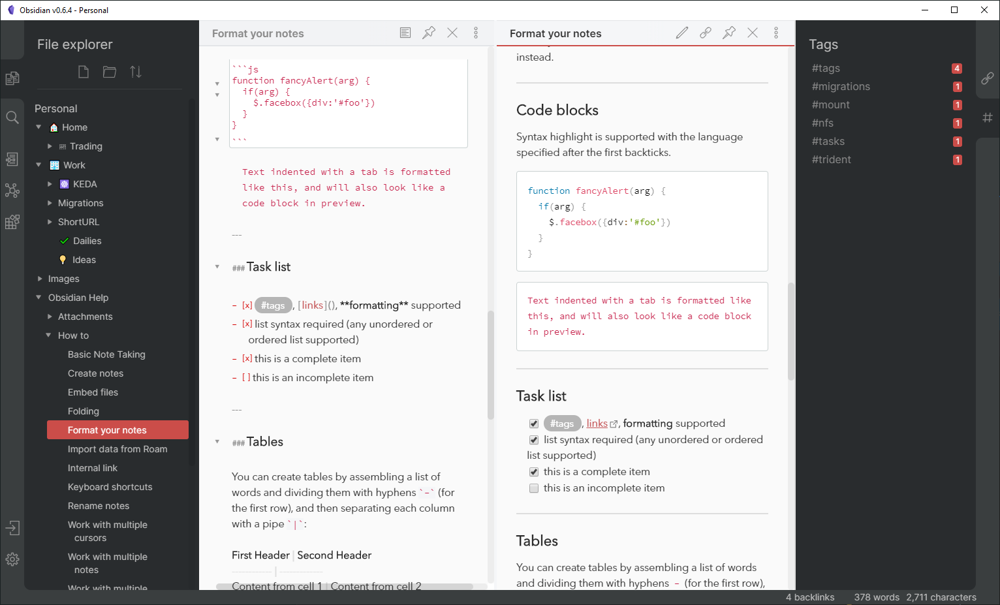
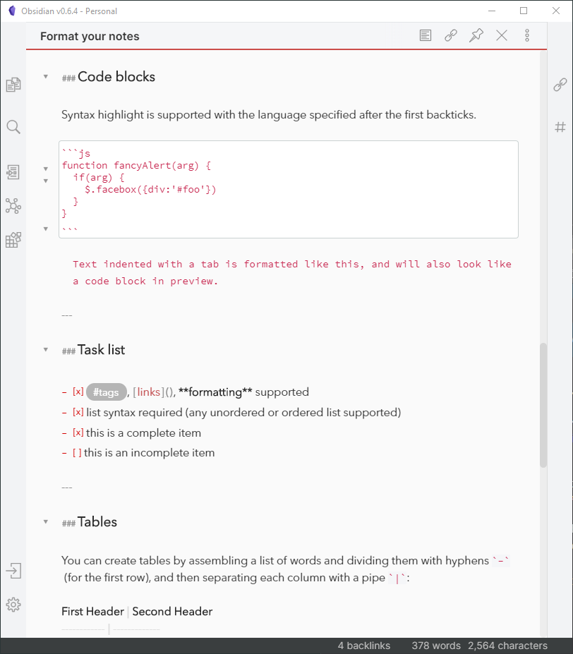
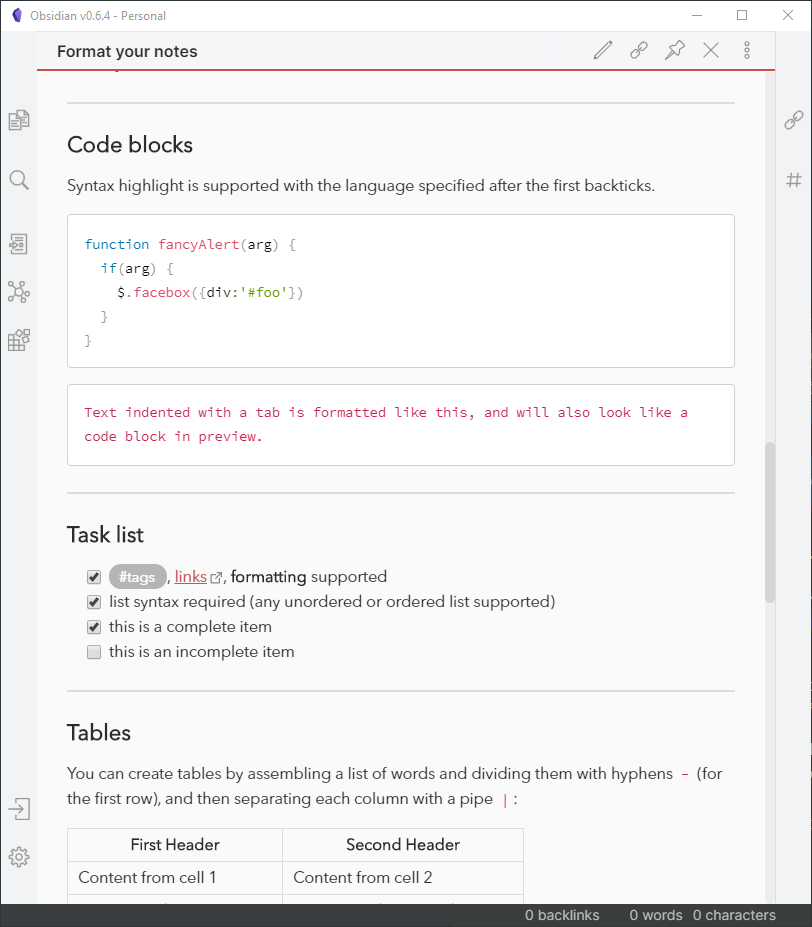

# Red Graphite for Obsidian.md
A light theme for Obsidian.md, based on Bear.app's Red Graphite theme. Here's a screenshot. There are more below the instructions.

## Easy Install
Somehow the easy install has more steps than the manual install... 
1. In Obsidian, click the **Settings** icon
1. Go to **Appearance** and ensure that your theme is set to `Moonstone (light)`
1. Go to **Plugins**, and enable **Custom CSS**
1. At the bottom of the settings window, go to **Community themes**
1. Scroll through the list of awesome themes until you find this one
1. Click **Use**.

## Manual Install
1. Download obsidian.css to your Obsidian vault folder.
1. In Obsidian, click the **Settings** icon
1. Go to **Appearance** and ensure that your theme is set to `Moonstone (light)`
1. Go to **Plugins**, and enable **Custom CSS**

## License
This theme is copied from Bear.app's Red Graphite theme, so it would be silly to pretend to have a license. Do as you please, all credit to the Bear designers for putting good colors together.

## More Screenshots

